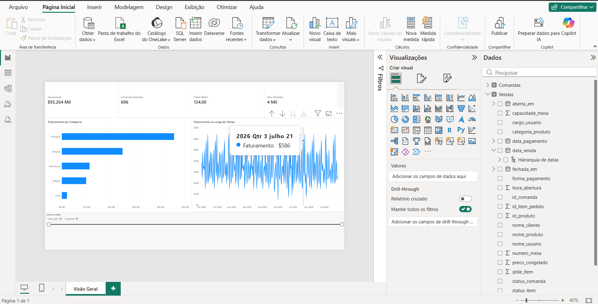

# MesaSync | Dashboard de Análise de Vendas

Projeto de portfólio desenvolvido para transformar dados operacionais de um restaurante em indicadores que apoiam a tomada de decisão.



## Objetivo

Construir um dashboard interativo para acompanhar o desempenho de vendas de um restaurante, analisando faturamento, comandas fechadas, ticket médio, itens vendidos e comportamento das vendas ao longo do tempo.

Os dados utilizados são demonstrativos, criados exclusivamente para este projeto de portfólio.

## Principais análises

- Faturamento por categoria de produto;
- Evolução do faturamento ao longo do tempo;
- Quantidade de comandas fechadas;
- Ticket médio por comanda;
- Quantidade de itens vendidos;
- Filtro de período para análise interativa.

## Regras de negócio consideradas

- Apenas comandas com status `FECHADA` entram no faturamento;
- Itens com status `CANCELADO` são desconsiderados;
- O ticket médio é calculado a partir do faturamento dividido pela quantidade de comandas fechadas.

## Tecnologias utilizadas

- PostgreSQL
- SQL
- Power BI
- DAX
- Power Query
- GitHub

## Modelagem dos dados

Os dados foram importados no Power BI a partir das views:

- `vw_resumo_comandas`
- `vw_vendas_analiticas`

Foi criada uma relação de muitos para um entre `Vendas[id_comanda]` e `Comandas[id_comanda]`.

As principais medidas DAX criadas foram:

- `Faturamento`
- `Comandas Fechadas`
- `Ticket Médio`
- `Itens Vendidos`

## Estrutura do repositório

```text
mesasync-data-dashboard/
├── database/
│   └── MesaSync_Demo_Sem_PLpgSQL.sql
├── powerbi/
│   └── MesaSync_Dashboard_PowerBI.pbix
├── images/
│   └── dashboard-visao-geral.png
└── README.md
```

## Como executar

1. Execute o script SQL no PostgreSQL para criar e popular o banco demonstrativo;
2. Abra o arquivo `.pbix` no Power BI Desktop;
3. Atualize a conexão com o banco PostgreSQL, se necessário;
4. Explore o dashboard usando o filtro de período.

## Autor

**Vitor de França Costa**  
[LinkedIn](https://www.linkedin.com/in/vitorfcosta/)
